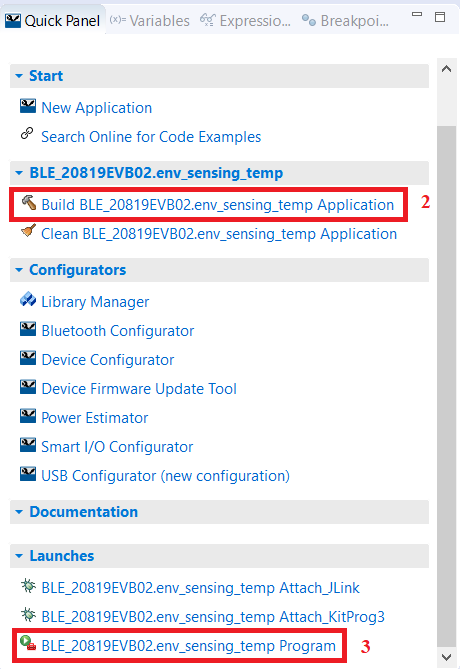
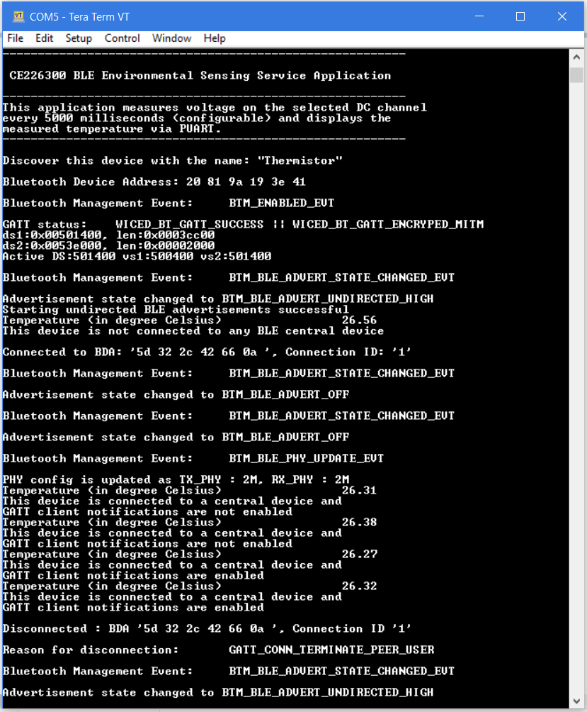
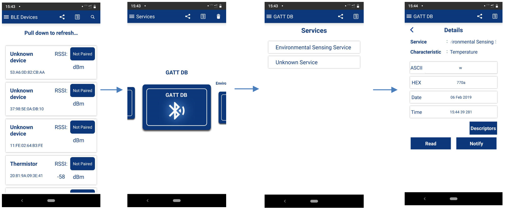
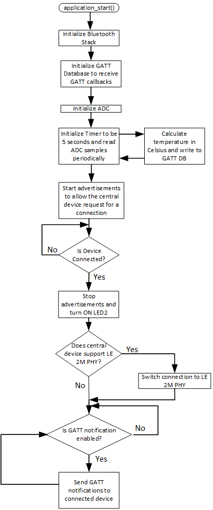

-------------------------------------------------------------------------------
## BLE Environment Sensing Temperature with CYW20XXX

*This code example demonstrates the implementation of a simple BLE Environmental Sensing Profile. It shows how to sense environmental conditions like temperature by using an on-chip ADC and sending values over a BLE 2M PHY link using the Bluetooth SoCs supported in BT-SDK. The instructions provided in this document are given for the CYW920819EVB-02 kit; however, they are also applicable for other supported kits that use the ModusToolbox™ IDE to build the code example.*

### Requirements

[ModusToolbox™ IDE](https://www.cypress.com/products/modustoolbox-software-environment) v 2.0

Programming Language: C

Associated Parts: CYW20819, CYW20820, CYW20719

### Supported Kits
CYW920819EVB-02

CYW920820EVB-02

CYW920719B2Q40EVB-01

Simply pick the supported kit in the IDE's New Application wizard. When you select a supported kit in the new application wizard the example is reconfigured automatically to work with the kit.

To work with a different supported kit, use the middleware selector to choose the BSP for the supported kit. You can also just start the process again and select a different kit.

If you want to use the application for a kit not listed here, you may need to update source files. If the kit does not have the required resources, the application may not work.

### Hardware Setup

This example uses the kit’s default configuration. Refer to the [kit user guide](http://www.cypress.com/CYW920819EVB-02), if required, to ensure that the kit is configured correctly.

The board should be connected to a PC using the USB micro-B cable. Also, make sure that the Thermistor Enable (J14) and Peripheral Enable (J18) jumpers are in the correct positions (shorted). See the “Jumper Setting” section in the respective kit user guide.

### Software Setup

This code example consists of two parts: a BLE Peripheral device (GATT Server) and a BLE Central device (GATT Client). A smartphone or a PC will act as the BLE Central device whereas the programmed kit will act as the BLE Peripheral device.

For the Central device, download and install the CySmart app for [iOS](https://itunes.apple.com/us/app/cysmart/id928939093?mt=8) or [Android](https://play.google.com/store/apps/details?id=com.cypress.cysmart&hl=en). You can also use the [CySmart Host Emulation Tool](http://www.cypress.com/go/cysmart) desktop application if you have access to the [CY5677 CySmart BLE 4.2 USB Dongle](http://www.cypress.com/documentation/development-kitsboards/cy5677-cysmart-bluetooth-low-energy-ble-42-usb-dongle). Alternatively, you can use any other mobile app that supports the BLE Environment Sensing Service.

Scan the following QR codes from your mobile phone to download the CySmart app.

| iOS                       | Android                           |
| ------------------------- | --------------------------------- |
|  |  |

This example uses a terminal emulator. Install one if you don’t have one. The instructions use [Tera Term](https://ttssh2.osdn.jp/index.html.en).

This example requires no additional software or tools.

### Operation

1. Connect the desired kit (for example, CYW920819EVB-02 Evaluation Kit) to your PC using the provided USB cable.

   The kit’s USB interface should enumerate as two serial communication (COM) ports – WICED HCI UART and WICED Peripheral UART (PUART).

   * The WICED HCI UART port is used by the ModusToolbox programming interface for downloading the application code; no user configuration is required for this port.

   * The WICED Peripheral UART port is used in this code example for printing the BLE stack event messages and other application-level log messages. Use a serial terminal emulation tool such as PuTTY or Tera Term. See the respective kit user guide for more details on USB driver installation.

2. You can browse the collection of starter applications during application creation through **File** > **New** > **ModusToolbox IDE Application** and then choose the respective target hardware and select the BLE application category. On choosing BLE category for supported targets, the ModusToolbox IDE will import a collection of supported applications. Select **env_sensing_temp** application and the click **build**  in the quick panel.

   **Note:** The CYW920819EVB-02, CYW920820EVB-02, and CYW920719B2Q40EVB-01 kits are pre-programmed with this Environment Sensing Profile code example out-of-the-box. For the most recent version of the code example, check the [GitHub](https://github.com/cypresssemiconductorco/Code-Examples-BT-SDK-for-ModusToolbox) repository. If you are not familiar with the import process, see [KBA225201](https://community.cypress.com/docs/DOC-15968).
3. Program the CYW20819 device on the kit with *env_sensing_temp* application. In the project explorer, select the **<App Name>** project. In the Quick Panel, scroll to the **Launches** section and click the **Program** configuration as shown in Figure 1.

   **Note:** If the download fails, it is possible that a previously loaded application is preventing programming. For example, the application might use a custom baud rate that the download process does not detect. In that case, it may be necessary to put the board in recovery mode, and then try the programming operation again from the IDE. To enter recovery mode, first, press and hold the **Recover** button (SW1), then press and release the **Reset** button (SW2), and finally release the **Recover** button (SW1).

   ​								Figure 1. Quick Links in ModusToolbox IDE

   

4. Use the PUART serial interface to view the Bluetooth stack and application trace messages:

   1. Use a serial terminal emulation tool and connect to the **PUART** serial port. Configure the terminal emulation tool to access the serial port using settings listed in Table 1.

      ​													Table 1. WICED PUART Settings

      | **WICED PUART Serial Port Configuration** | **Value**     |
      | ----------------------------------------- | :------------ |
      | Baud rate                                 | 115200 bps    |
      | Data                                      | 8 bits        |
      | Parity                                    | None          |
      | Stop                                      | 1 bit         |
      | Flow control                              | None          |
      | Line Feed option                          | CR+LF or Auto |

   2. The Bluetooth stack and application trace messages will appear in the terminal window as shown in Figure 2. You may have to reset the device after opening the terminal emulator as you might have missed the initial trace messages after programming.

      ​					Figure 2. Log Messages on WICED PUART Serial Port

      

5. To test using the CySmart mobile app:

   1. Turn ON Bluetooth on your Android or iOS device.

   2. Launch the CySmart app. Figure 3 shows the steps for using the CySmart Android app. The screenshots provided in this document are from the Android app; these will vary slightly from the iOS version.

      ​				Figure 3. Testing with the CySmart App on Android

      

   3. Pull (swipe) down on the home screen of the CySmart app to start scanning for BLE Peripherals; your device appears in the CySmart app home screen with the Bluetooth device name as “Thermistor”. Select your device to establish a BLE connection. Once the connection is established, the red LED (LED2) turns ON.

   4. Select **GATT DB** from the carousel view. The CySmart app displays the available services.

6. Select **Environmental Sensing Service** from the list of available services. In the CySmart app for iOS devices, the service will be shown as an ‘unknown service’.

   1. At the bottom of the screen, you can find three buttons, namely,

      * Descriptors (To view additional information about the Environmental Sensing Profile such as valid range, measurement interval, and measurement techniques)

      * Read (To read the last sampled temperature value once)

      * Notify (To receive notifications when the server sends an updated temperature value. The code example is configured to send a temperature value every 5 seconds)

   2. Tap the Notify button in the bottom of the screen.

      * The CySmart app displays the temperature characteristic in two representations (ASCII and hexadecimal values), and the date and time of the last received temperature notification.

      * The bytes in the 2-byte hexadecimal value need to be swapped to interpret the temperature. For example, if the hexadecimal representation in the CySmart app is 0xCE08, then swapping the bytes result in 0x08CE which is the decimal equivalent of 2254. The most significant byte (MSB) represents the integer part of the temperature in Celsius and the least significant byte (LSB) represent the fractional part of the temperature in degree celsius (i.e., 22.54 °C).

   Upon disconnecting the Central device from the Peripheral device by user
   action in the CySmart App or by moving out of the range, the red LED (LED2)
turns OFF. You will be notified in the PUART log about the remote device’s
   Bluetooth address that has recently disconnected.

### Design and Implementation

This code example is written in a way that is generic across multiple devices and platforms. The code example application runs on the Arm® Cortex® core of the Bluetooth SoC. The functionality of the code example will remain the same on all the supported kits; the application was developed using the ModusToolbox IDE.

This application demonstrates the ADC and BLE capability of the CYW20819 device. On the CYW920819EVB-02 kit, a negative temperature coefficient thermistor is used to measure the ambient temperature. The thermistor present on the board depends on the supported platform. For example, the CYW920819EVB-02 evaluation board uses the NCU15WF104F60RC temperature sensor from Murata. It is a 100-kΩ thermistor at 25°C with 1% accuracy connected to GPIO P8 on the CYW20819 device. The ADC is used to measure the voltage across the thermistor channel to determine the temperature. The temperature value is sent over BLE to a Central device, and to the PUART as debug trace messages. This project demonstrates the following features:

- Functionality of the ADC for temperature measurement
- BLE Environment Sensing Service (ESS) – GATT Read and Notify functionality
- Debug Trace messages
- Connection with one Central device
- BLE 5.0 Feature – LE 2M PHY if the Central device supports 2M PHY
- Connection status indication through LED
- Secure and non-secure Over-the-Air (OTA) firmware upgrade functionality

The project consists of the following files:

​										Table 2. BLE_EnvironmentSensing Project Files

| **File Name**                                                | **Comments**                                                 |
| ------------------------------------------------------------ | ------------------------------------------------------------ |
| *thermistor_app.c*                                           | This file contains the application_start() function, which is the entry point   of the user code execution and can be considered as the equivalent of the main() function in standard C. The application_start function initializes the   Bluetooth stack by calling wiced_bt_stack_init(). This function also registers a Bluetooth management event callback function. After the Bluetooth stack is initialized, you have the control to execute your own application code based on different Bluetooth events received in the management callback. This management callback acts as a Finite State Machine (FSM) in executing the application code. For the Bluetooth Enabled Event (BTM_ENABLED_EVT), the thermistor_app_init() function is called. This function   initializes the ADC, starts a timer to measure the temperature periodically   by calling seconds_timer_temperature_cb(), registers a callback for GATT events, initializes the GATT database, and starts BLE advertisements. The thermistor_app.c file also holds the function thermistor_set_advertisement_data() which sets the advertisement data   for the device to be discovered. |
| *thermistor_gatt_handler.c*   *thermistor_gatt_handler.h*    | These files consist of the code to perform GATT read handler, GATT write handler and GATT indication confirm handler. These files also hold the code to switch to LE 2M PHY if the Central device supports it. |
| *thermistor_util_functions.c*   *thermistor_util_functions.h* | These files consist of the utility functions that will help make debugging   and developing the application easier by providing more meaningful   information. For example, this API provides meaningful strings for Bluetooth events, Bluetooth advertisement modes, GATT status messages, and GATT disconnection reasons. |
| *wiced_app_cfg.c*                                            | These files contain the runtime Bluetooth stack configuration parameters like device name, advertisement/connection interval, and buffer pool configurations. |
| *cycfg_bt.cybt*                                              | This is the Bluetooth Configurator file for the application to generate the source files(*cycfg_gatt_db.c*,  *cycfg_gatt_db.h*) for GATT configuration. These source files reside in the *GeneratedSource* folder under the application folder. They contain the GATT database information generated using the Bluetooth Configurator tool. There are a few manual edits made to these files to enable OTA firmware upgrade in the code example which is explained in the Over-the-Air (OTA) Firmware Upgrade section. |
| *ecdsa256_pub.c*                                             | This file resides in the *secure* folder under the application folder. This file contains the public key for ecdsa256 encryption used in Secure OTA Firmware upgrade. |
| *readme.md*                                                  | This file provides information about the code example such as how the application is designed and implemented and how to download the application and what to observe from the application, etc. |

#### Flowchart

​					Figure 4. Flowchart of the BLE Environment Sensing Temperature Application

The flowchart as shown in Figure 4 gives an overview of the Environmental Sensing Profile application. The Environmental Sensing Profile in this application consists of one of the Bluetooth SIG-defined services, namely the Environment Sensing Service (ESS). This project implements only the temperature characteristic from the environmental sensing service. This characteristic supports notification and read operations, which allows the GATT Server to send data to the connected GATT Client device whenever new data is available and a read to be performed from the GATT Client device. The Bluetooth Configurator provided by ModusToolbox makes it easier to design and implement the GATT DB. The Bluetooth Configurator generates the *cycfg_gatt_db.c* and *cycfg_gatt_db.h* files. All Environmental Sensing Profile-related variables and functions are contained in these files. When the GATT DB is initialized after Bluetooth Stack initialization, all profile-related values will be ready to be advertised to the Central device. For more details on Bluetooth Configurator, please refer to the *ModusToolbox Bluetooth Configurator Guide*.

The code example utilizes the on-board analog temperature sensor (thermistor) to send temperature values over BLE. The temperature sensor component on the board vary depending on the platform. On the CYW920819EVB-02, it is a Negative Temperature Coefficient (NTC) temperature sensor whose resistance increases when ambient temperature increases. The datasheet of the thermistor component provides details on the characteristics for varying resistance with respect to temperature. The thermistor library provides APIs independent of the thermistor interface on the board to the Cypress Bluetooth chip. This code example utilizes the thermistor library from BT SDK.

The CYW20719 has a Hardware Floating Point (FPU) whereas CYW20819/CYW20820 do not have a Hardware Floating Point Unit (FPU). The source files of the thermistor library hold a mapping table between the thermistor’s resistance values and temperatures. The lookup function calculates the temperatures at the previous resistance and the next resistance to calculate the slope. Using this slope value, an accurate temperature is calculated. The temperature value is sent once every 5 seconds to the Central device when connected and GATT notifications are enabled by the Central. To send the temperature values once every 5 seconds, an application timer is used which can be configured as MILLI_SECONDS_PERIODIC_TIMER or SECONDS_PERIODIC_TIMER.

When the Peripheral device is connected, LED2 will be ON; when it is disconnected, LED2 will be OFF. To turn the LED ON and OFF, generic GPIO functions are used to drive the output pin HIGH or LOW. The LEDs present in the supported kits are active LOW LEDs, which means that the LED turns ON when the GPIO is driven LOW.

The *thermistor_gatt_handler.c* and *thermistor_gatt_handler.h* files handle the functionality of GATT callbacks from the Central device. On receiving a connection request, the Bluetooth stack gives a GATT event to the application of *wiced_bt_gatt_evt_t* type. For example, the LED toggle functionality is implemented in the GATT connection callback. The connection event also sets the PHY Rx and Tx connection to LE 2M PHY if the Central device supports it as specified by the Bluetooth 5.0 standard. On a disconnection event, the code resets the Client Characteristic Configuration Descriptor (CCCD) value so that on a reconnect event, notifications will be disabled.

In *wiced_app_cfg.c,* all the runtime Bluetooth stack configuration parameters are defined;  these will be initialized during Bluetooth stack initialization. Some of the configurations include device name, connection interval, advertisement interval, advertisement channels to use, number of client connections, and Maximum Transmission Unit (MTU). You also have the flexibility to configure the buffer pool size, which helps in optimizing the memory and transmission rate depending on the application use case.

The project also contains *thermistor_util_functions.c* and *thermistor_util_functions.h* which provide APIs to see meaningful messages in debug logs in the PUART. Most of the status messages in Bluetooth stack are represented in enumerated values. These functions allow you to view the respective strings instead of the enumerated values.

#### Over-The-Air (OTA) Firmware Upgrade

This code example demonstrates OTA firmware upgrade using a middleware library called *fw_upgrade_lib* and a custom BLE service called *FWUpgradeService*. The service and its characteristic have fixed UUIDs, properties, and permissions. These have been pre-configured in the code example with the correct values and settings using the Bluetooth Configurator.

The library functions expect specific handles for the OTA service and characteristics. If you modify/save the Bluetooth Configurator settings, it may be necessary to manually edit the *cycfg_gatt_db.h* file inside the *GeneratedSource* folder to use the following handle definitions after saving from the Bluetooth Configurator.

~~~c
#include "wiced_bt_ota_firmware_upgrade.h"

/* Service FWUpgradeService */
#define HDLS_FWUPGRADESERVICE                                            HANDLE_OTA_FW_UPGRADE_SERVICE

/* Characteristic FWUpgradeControlPoint */
#define HDLC_FWUPGRADESERVICE_FWUPGRADECONTOLPOINT HANDLE_OTA_FW_UPGRADE_CHARACTERISTIC_CONTROL_POINT
#define HDLC_FWUPGRADESERVICE_FWUPGRADECONTOLPOINT_VALUE HANDLE_OTA_FW_UPGRADE_CONTROL_POINT

/* Descriptor Client Characteristic Configuration */
#define HDLD_FWUPGRADESERVICE_FWUPGRADECONTOLPOINT_CLIENT_CHAR_CONFIG    HANDLE_OTA_FW_UPGRADE_CLIENT_CONFIGURATION_DESCRIPTOR

/* Characteristic FWUpgradeData */
#define HDLC_FWUPGRADESERVICE_FWUPGRADEDATA                              HANDLE_OTA_FW_UPGRADE_CHARACTERISTIC_DATA
#define HDLC_FWUPGRADESERVICE_FWUPGRADEDATA_VALUE                        HANDLE_OTA_FW_UPGRADE_DATA
~~~

Initialization of the OTA library is done during application initialization in *thermistor_app.c*. All other OTA functionality is contained in the GATT callback handler in *thermistor_gatt_handler.c*.

The file used for OTA upgrade is created during a build and is called *mainapp_download.ota.bin*. The application’s build folder depends on the build configuration used; by default, it is set to Debug.

Cypress provides executables and source code for OTA firmware upgrade applications for Windows 10 and Android in the GitHub BT-SDK OTA repository. You can also import the OTA related peer apps by following the new application procedure and choosing the OTA category of applications.

See the *readme.txt* file in that repository for additional information.

The code example is configured for a secure OTA service by default. Secure OTA uses elliptic curve cryptography to implement a secure method to upgrade the firmware of Bluetooth devices. The user can change to custom OTA FW Upgrade service instead of secure OTA using BT Configurator. For more details on how to create custom OTA FW Upgrade service, please refer to *ModusToolbox Bluetooth Configurator Guide* by pressing **F1** in **Bluetooth Configurator**.

Secure OTA uses public/private key encryption. The code example has a file located at *secure/ecdsa256_pub.c* containing the public key. To use secure OTA, you should generate your own public/private key pair using the tools (*ecdsa256 binary*) available in the above repository or your preferred tool set.

The executable *ecdsa_genkey.exe* will generate the key pair and the *ecdsa256_pub.c* file,  which should be replaced in the *secure* folder in the code example.

The executable *ecdsa_sign.exe* is used to sign the *.bin* file after a build so that it can be loaded using the OTA upgrade service.

For more details on the Secure OTA firmware upgrade, see the *WICED Secure Over-the-Air Firmware Upgrade* document in ModusToolbox Help.

### Related Resources

| Application Notes                                            |                                                              |
| :----------------------------------------------------------- | :----------------------------------------------------------- |
| [AN225684 – Getting Started with CYW208xx](https://www.cypress.com/an225684) | Describes CYW20819 and CYW20820 Bluetooth SoC and how to build your first BLE application using the device in ModusToolbox IDE. |
| [CYW20819 Feature and Peripheral Guide](https://www.cypress.com/documentation/application-notes/an226546-cyw20819-feature-and-peripheral-guide) | This document introduces the CYW20819 ultra-low power, dual-mode BT v5.0 wireless MCU with an Arm® Cortex®- M4 CPU by exploring the CYW20819 device architecture along with the development tools to write applications using ModusToolbox software. |
| [CYW20719 Product Guide](https://community.cypress.com/docs/DOC-14590) | This document introduces the CYW20719 ultra-low power dual-mode BT v5.0 wireless MCU with an Arm® Cortex®-M4 CPU by exploring both CYW20719 device architecture along with the development tools to write applications using WICED Studio™. |
| [CY5677 CySmart BLE 4.2 USB Dongle](https://www.cypress.com/documentation/development-kitsboards/cy5677-cysmart-bluetooth-low-energy-ble-42-usb-dongle) | CY5677 CySmart BLE 4.2 USB Dongle is a BLE-USB bridge featuring a Bluetooth 4.2-compliant PSoC® 4 BLE, enabling you to test and debug Bluetooth® Low Energy (BLE) systems. |
| **Code Examples**                                            |                                                              |
| [Code Examples for ModusToolbox IDE](https://github.com/cypresssemiconductorco/Code-Examples-for-ModusToolbox-Software) | A single repo with demo applications and snippets for various bluetooth devices and kits, including mesh network examples. |
| **Device Documentation**                                     |                                                              |
| CYW20XXX Datasheets                                          | [CYW20819 Datasheet](https://www.cypress.com/datasheet/CYW20819), [CYW20820 Datasheet](https://www.cypress.com/datasheet/CYW20820), [CYW20719 Datasheet](https://www.cypress.com/documentation/datasheets/cyw20719-enhanced-low-power-bredrble-bluetooth-50-soc) |
| **Development Kits**                                         | Available at Cypress.com                                     |
| [CYW920819EVB-02](http://www.cypress.com/CYW920819EVB-02)    | The Cypress CYW920819EVB-02 Evaluation Kit enables you to evaluate and develop single-chip Bluetooth applications using the CYW20819, an ultra-low-power dual-mode Bluetooth 5.0 wireless MCU device. |
| [CYW920820EVB-02](http://www.cypress.com/CYW920820EVB-02)    | The Cypress CYW920820EVB-02 Evaluation Kit enables you to evaluate and develop single-chip Bluetooth applications using the CYW20820 with iPA, an ultra-low-power dual-mode Bluetooth 5.0 wireless MCU device. |
| [CYW920719B2Q40EVB-01]([CYW920719B2Q40EVB-01](http://www.cypress.com/CYW920719B2Q40EVB-02)) | The Cypress CYW920719B2Q40EVB-01 Evaluation Kit enables you to evaluate and develop single-chip Bluetooth applications using the CYW20719, an ultra-low-power dual-mode Bluetooth 5.0 wireless MCU device. |
| **Tools **                                                   |                                                              |
| [ModusToolbox   IDE](http://www.cypress.com/modustoolbox)    | The Cypress IDE for PSoC 6 and IoT designers                 |

## Common application settings

Application settings below are common for all BTSDK applications and can be configured via the makefile of the application or passed in via the command line.

- BT\_DEVICE\_ADDRESS 
    - Set the BDA (Bluetooth Device Address) for your device. The address is 6 bytes, for example, 20819A10FFEE. By default, the SDK will set a BDA for your device by combining the 7 hex digit device ID with the last 5 hex digits of the host PC MAC address.

- UART 
    - Set to the UART port you want to use to download the application. For example 'COM6' on Windows or '/dev/ttyWICED\_HCI\_UART0' on Linux or '/dev/tty.usbserial-000154' on macOS. By default, the SDK will auto-detect the port.

- ENABLE_DEBUG 
    - For HW debugging, select the option '1'. See the document [WICED-Hardware-Debugging](https://github.com/cypresssemiconductorco/btsdk-docs/blob/master/docs/BT-SDK/WICED-Hardware-Debugging.pdf) for more information. This setting configures GPIO for SWD.
      - CYW920819EVB-02/CYW920820EVB-02: SWD signals are shared with D4 and D5, see SW9 in schematics.
      - CYBT-213043-MESH/CYBT-213043-EVAL : SWD signals are routed to P02=SWDCK and P03=SWDIO. Use expansion connectors to connect VDD, GND, SWDCK, and SWDIO to your SWD Debugger probe.
	  - CYBT-223058-EVAL : SWD signals are routed to P02=SWDCK and P03=SWDIO. Use expansion connectors to connect VDD, GND, SWDCK, and SWDIO to your SWD Debugger probe.
	  - CYBT-243053-EVAL: SWD signals are routed to P12=SWDCK and P13=SWDIO. Use expansion connectors to connect VDD, GND, SWDCK, and SWDIO to your SWD Debugger probe.
	  - CYBT-253059-EVAL: SWD signals are routed to P12=SWDCK and P13=SWDIO. Use expansion connectors to connect VDD, GND, SWDCK, and SWDIO to your SWD Debugger probe.
      - CYW989820EVB-01: SWDCK (P02) is routed to the J13 DEBUG connector, but not SWDIO. Add a wire from J10 pin 3 (PUART CTS) to J13 pin 2 to connect GPIO P10 to SWDIO.
      - CYW920719B2Q40EVB-01: PUART RX/TX signals are shared with SWDCK and SWDIO. Remove RX and TX jumpers on J10 when using SWD. PUART and SWD cannot be used simultaneously on this board unless these pins are changed from the default configuration.
      - CYW920721B2EVK-02: SWD hardware debugging supported. SWD signals are shared with D4 and D5, see SW9 in schematics.
      - CYW920721B2EVK-03, CYW920721M2EVK-01: SWD hardware debugging is not supported.
      - CYW920721M2EVK-02: SWD hardware debugging is supported. The default setup uses P03 for SWDIO and P05 for SWDCK.
      - CYW920706WCDEVAL: SWD debugging requires fly-wire connections. The default setup uses P15 (J22 pin 3) for SWDIO and P30 (J19 pin 2) for SWDCK. P30 is shared with BTN1.
      - CYW920735Q60EVB-01: SWD hardware debugging supported. The default setup uses the J13 debug header, P3 (J13 pin 2) for SWDIO and P2 (J13 pin 4) for SWDCK.  They can be optionally routed to D4 and D4 on the Arduino header J4, see SW9 in schematics.
      - CYW920835REF-RCU-01: SWD hardware debugging is not supported.
      - CYW9M2BASE-43012BT: SWD hardware debugging is not supported.
      - CYW943012BTEVK-01: SWD hardware debugging is not supported.

## Building code examples

**Using the ModusToolbox IDE**

1. Install ModusToolbox 2.2.
2. In the ModusToolbox IDE, click the **New Application** link in the Quick Panel (or, use **File > New > ModusToolbox IDE Application**).
3. Pick your board for BTSDK under WICED Bluetooth BSPs.
4. Select the application in the IDE.
5. In the Quick Panel, select **Build** to build the application.
6. To program the board (download the application), select **Program** in the Launches section of the Quick Panel.

**Using command line**

1. Install ModusToolbox 2.2
2. On Windows, use Cygwin from \ModusToolbox\tools_2.2\modus-shell\Cygwin.bat to build apps.
3. Use the tool 'project-creator-cli' under \ModusToolbox\tools_2.2\project-creator\ to create your application. 
   > project-creator-cli --board-id (BSP) --app-id (appid) -d (dir)  
   See 'project-creator-cli --help' for useful options to list all available BSPs, and all available apps per BSP. 
   For example: 
   > project-creator-cli --app-id mtb-example-btsdk-empty --board-id CYW920706WCDEVAL -d .
4. To build the app call make build. For example: 
   > cd mtb-examples-btsdk-empty 
   > make build 
6. To program (download to) the board, call: 
   > make qprogram 
7. To build and program (download to) the board, call: 
   > make program 

   Note: make program = make build + make qprogram

## Downloading an application to a board

If you have issues downloading to the board, follow the steps below:

- Press and hold the 'Recover' button on the board.
- Press and hold the 'Reset' button on the board.
- Release the 'Reset' button.
- After one second, release the 'Recover' button.

Note: this is only applicable to boards that download application images to FLASH storage. Boards that only support RAM download (DIRECT_LOAD) such as CYW9M2BASE-43012BT can be power cycled to boot from ROM.

## SDK software features

- Dual-mode Bluetooth stack included in the ROM (BR/EDR and LE)
- Bluetooth stack and profile level APIs for embedded Bluetooth application development
- WICED HCI protocol to simplify host/MCU application development
- APIs and drivers to access on-board peripherals
- Bluetooth protocols include GAP, GATT, SMP, RFCOMM, SDP, AVDT/AVCT, LE Mesh
- LE and BR/EDR profile APIs, libraries, and sample apps
- Support for Over-The-Air (OTA) upgrade
- Device Configurator for creating custom pin mapping
- Bluetooth Configurator for creating LE GATT Database
- Peer apps based on Android, iOS, Windows, etc. for testing and reference
- Utilities for protocol tracing, manufacturing testing, etc.
- Documentation for APIs, datasheets, profiles, and features
- BR/EDR profiles: A2DP, AVRCP, HFP, HSP, HID, SPP, MAP, PBAP, OPP
- LE profiles: Mesh profiles, HOGP, ANP, BAP, HRP, FMP, IAS, ESP, LE COC
- Apple support: Apple Media Service (AMS), Apple Notification Center Service (ANCS), iBeacon, Homekit, iAP2
- Google support: Google Fast Pair Service (GFPS), Eddystone
- Amazon support: Alexa Mobile Accessories (AMA)

Note: this is a list of all features and profiles supported in BTSDK, but some WICED devices may only support a subset of this list.

## List of boards available for use with BTSDK

- [CYW20819A1 chip](https://github.com/cypresssemiconductorco/20819A1)
    - [CYW920819EVB-02](https://github.com/cypresssemiconductorco/TARGET_CYW920819EVB-02), [CYBT-213043-MESH](https://github.com/cypresssemiconductorco/TARGET_CYBT-213043-MESH), [CYBT-213043-EVAL](https://github.com/cypresssemiconductorco/TARGET_CYBT-213043-EVAL), [CYW920819REF-KB-01](https://github.com/cypresssemiconductorco/TARGET_CYW920819REF-KB-01)
- [CYW20820A1 chip](https://github.com/cypresssemiconductorco/20820A1)
    - [CYW920820EVB-02](https://github.com/cypresssemiconductorco/TARGET_CYW920820EVB-02), [CYW989820EVB-01](https://github.com/cypresssemiconductorco/TARGET_CYW989820EVB-01), [CYBT-243053-EVAL](https://github.com/cypresssemiconductorco/TARGET_CYBT-243053-EVAL)
- [CYW20721B2 chip](https://github.com/cypresssemiconductorco/20721B2)
    - [CYW920721B2EVK-02](https://github.com/cypresssemiconductorco/TARGET_CYW920721B2EVK-02), [CYW920721B2EVK-03](https://github.com/cypresssemiconductorco/TARGET_CYW920721B2EVK-03), [CYW920721M2EVK-01](https://github.com/cypresssemiconductorco/TARGET_CYW920721M2EVK-01), [CYW920721M2EVK-02](https://github.com/cypresssemiconductorco/TARGET_CYW920721M2EVK-02), [CYBT-423060-EVAL](https://github.com/cypresssemiconductorco/TARGET_CYBT-423060-EVAL), [CYBT-483062-EVAL](https://github.com/cypresssemiconductorco/TARGET_CYBT-483062-EVAL), [CYBT-413061-EVAL](https://github.com/cypresssemiconductorco/TARGET_CYBT-413061-EVAL)
- [CYW20719B2 chip](https://github.com/cypresssemiconductorco/20719B2)
    - [CYW920719B2Q40EVB-01](https://github.com/cypresssemiconductorco/TARGET_CYW920719B2Q40EVB-01), [CYBT-423054-EVAL](https://github.com/cypresssemiconductorco/TARGET_CYBT-423054-EVAL), [CYBT-413055-EVAL](https://github.com/cypresssemiconductorco/TARGET_CYBT-413055-EVAL), [CYBT-483056-EVAL](https://github.com/cypresssemiconductorco/TARGET_CYBT-483056-EVAL)
- [CYW20706A2 chip](https://github.com/cypresssemiconductorco/20706A2)
    - [CYW920706WCDEVAL](https://github.com/cypresssemiconductorco/TARGET_CYW920706WCDEVAL), [CYBT-353027-EVAL](https://github.com/cypresssemiconductorco/TARGET_CYBT-353027-EVAL), [CYBT-343026-EVAL](https://github.com/cypresssemiconductorco/TARGET_CYBT-343026-EVAL)
- [CYW20735B1 chip](https://github.com/cypresssemiconductorco/20735B1)
    - [CYW920735Q60EVB-01](https://github.com/cypresssemiconductorco/TARGET_CYW920735Q60EVB-01)
- [CYW20835B1 chip](https://github.com/cypresssemiconductorco/20835B1)
    - [CYW920835REF-RCU-01](https://github.com/cypresssemiconductorco/TARGET_CYW920835REF-RCU-01)
- [CYW43012C0 chip](https://github.com/cypresssemiconductorco/43012C0)
    - [CYW9M2BASE-43012BT](https://github.com/cypresssemiconductorco/TARGET_CYW9M2BASE-43012BT), [CYW943012BTEVK-01](https://github.com/cypresssemiconductorco/TARGET_CYW943012BTEVK-01)

## Folder structure

All BTSDK code examples need the 'mtb\_shared\wiced\_btsdk' folder to build and test the apps. 'wiced\_btsdk' includes the 'dev-kit' and 'tools' folders. The contents of the 'wiced\_btsdk' folder will be automatically populated incrementally as needed by the application being used.

**dev-kit**

This folder contains the files that are needed to build the embedded Bluetooth apps.

* baselib: Files for chips supported by BTSDK. For example CYW20819, CYW20719, CYW20706, etc.

* bsp: Files for BSPs (platforms) supported by BTSDK. For example CYW920819EVB-02, CYW920721B2EVK-02, CYW920706WCDEVAL etc.

* btsdk-include: Common header files needed by all apps and libraries.

* btsdk-tools: Build tools needed by BTSDK.

* libraries: Profile libraries used by BTSDK apps such as audio, LE, HID, etc.

**tools**

This folder contains tools and utilities need to test the embedded Bluetooth apps.

* btsdk-host-apps-bt-ble: Host apps (Client Control) for LE and BR/EDR embedded apps, demonstrates the use of WICED HCI protocol to control embedded apps.

* btsdk-host-peer-apps-mesh: Host apps (Client Control) and Peer apps for embedded Mesh apps, demonstrates the use of WICED HCI protocol to control embedded apps, and configuration and provisioning from peer devices.

* btsdk-peer-apps-ble: Peer apps for embedded LE apps.

* btsdk-peer-apps-ota: Peer apps for embedded apps that support Over The Air Firmware Upgrade.

* btsdk-utils: Utilities used in BTSDK such as BTSpy, wmbt, and ecdsa256.

See README.md in the sub-folders for more information.

## ModusToolbox Tools

Source code generation tools installed by ModusToolbox installer:

- Device Configurator:
      A GUI tool to create custom pin mappings for your device.
- Bluetooth Configurator:
      A GUI tool to create and configure the LE GATT Database and BR/EDR SDP records for your application.

## Using BSPs (platforms)

BTSDK BSPs are located in the \mtb\_shared\wiced\_btsdk\dev-kit\bsp\ folder by default.

#### a. Selecting an alternative BSP

The application makefile has a default BSP. See "TARGET". The makefile also has a list of other BSPs supported by the application. See "SUPPORTED_TARGETS". To select an alternative BSP, use Library Manager from the Quick Panel to deselect the current BSP and select an alternate BSP. Then right-click the newly selected BSP and choose 'Set Active'.  This will automatically update TARGET in the application makefile.

#### b. Custom BSP

**Complete BSP**

To create and use a complete custom BSP that you want to use in applications, perform the following steps:

1. Select an existing BSP you wish to use as a template from the list of supported BSPs in the mtb\_shared\wiced\_btsdk\dev-kit\bsp\ folder.
2. Make a copy in the same folder and rename it. For example mtb\shared\wiced\_btsdk\dev-kit\bsp\TARGET\_mybsp. 
   **Note:** This can be done in the system File Explorer and then refresh the workspace in Eclipse to see the new project.  Delete the .git sub-folder from the newly copied folder before refreshing in Eclipse.
   If done in the IDE, an error dialog may appear complaining about items in the .git folder being out of sync.  This can be resolved by deleting the .git sub-folder in the newly copied folder.

3. In the new mtb\_shared\wiced\_btsdk\dev-kit\bsp\TARGET\_mybsp folder, rename the existing/original (BSP).mk file to mybsp.mk.
4. In the application makefile, set TARGET=mybsp and add it to SUPPORTED\_TARGETS as well as TARGET\_DEVICE\_MAP.  For example: mybsp/20819A1
5. Update design.modus for your custom BSP if needed using the **Device Configurator** link under **Configurators** in the Quick Panel.
6. Update the application makefile as needed for other custom BSP specific attributes and build the application.

**Custom Pin Configuration Only - Multiple Apps**

To create a custom pin configuration to be used by multiple applications using an existing BSP that supports Device Configurator, perform the following steps:

1. Create a folder COMPONENT\_(CUSTOM)\_design\_modus in the existing BSP folder. For example mtb\_shared\wiced\_btsdk\dev-kit\bsp\TARGET\_CYW920819EVB-02\COMPONENT\_my\_design\_modus
2. Copy the file design.modus from the reference BSP COMPONENT\_bsp\_design\_modus folder under mtb\_shared\wiced\_btsdk\dev-kit\bsp\ and place the file in the newly created COMPONENT\_(CUSTOM)\_design\_modus folder.
3. In the application makefile, add the following two lines 
   DISABLE\_COMPONENTS+=bsp\_design\_modus 
   COMPONENTS+=(CUSTOM)\_design\_modus 
   (for example COMPONENTS+=my\_design\_modus)
4. Update design.modus for your custom pin configuration if needed using the **Device Configurator** link under **Configurators** in the Quick Panel.
5. Building of the application will generate pin configuration source code under a GeneratedSource folder in the new COMPONENT\_(CUSTOM)\_design\_modus folder.

**Custom Pin Configuration Only - Per App**

To create a custom configuration to be used by a single application from an existing BSP that supports Device Configurator, perform the following steps:

1. Create a folder COMPONENT\_(BSP)\_design\_modus in your application. For example COMPONENT\_CYW920721B2EVK-03\_design\_modus
2. Copy the file design.modus from the reference BSP under mtb\_shared\wiced\_btsdk\dev-kit\bsp\ and place the file in this folder.
3. In the application makefile, add the following two lines 
   DISABLE\_COMPONENTS+=bsp\_design\_modus 
   COMPONENTS+=(BSP)\_design\_modus 
   (for example COMPONENTS+=CYW920721B2EVK-03\_design\_modus)
4. Update design.modus for your custom pin configuration if needed using the **Device Configurator** link under **Configurators** in the Quick Panel.
5. Building of the application will generate pin configuration source code under the GeneratedSource folder in your application.

## Using libraries

The libraries needed by the app can be found in in the mtb\_shared\wiced\_btsdk\dev-kit\libraries folder. To add an additional library to your application, launch the Library Manager from the Quick Panel to add a library. Then update the makefile variable "COMPONENTS" of your application to include the library. For example: 
   COMPONENTS += fw\_upgrade\_lib

## Documentation

BTSDK API documentation is available [online](https://cypresssemiconductorco.github.io/btsdk-docs/BT-SDK/index.html)

Note: For offline viewing, git clone the [documentation repo](https://github.com/cypresssemiconductorco/btsdk-docs)

BTSDK Technical Brief and Release Notes are available [online](https://community.cypress.com/community/software-forums/modustoolbox-bt-sdk)
